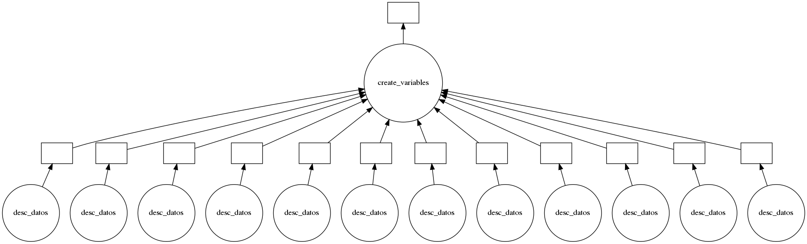

# Resumen

Amigos, les comparto por el momento un breve resumen de lo que hice para que empiecen a hacer pruebas con las dos funciones que tengo en el script regression.py

### download_info(lista_desc)

Esta función es la que descarga toda la información desde la fecha en que se corra hasta 3 años atrás o los que se le especifiquen. Este proceso está hecho en paralelo ya que es la parte más pesada de la aplicación, hace los 12 requests al mismo tiempo y así obtiene todos los datos en 1/12 del tiempo (aprox). 

Les dejo ina foto del diagrama de cómo funciona en paralelo 

 

### analisis_p(lista_run)

Esta otra función toma los commodities que se le especifiquen en la *lista_run*, asi como el tiempo a predecir y el r2 mínima a la que se quiera llegar, esto hace que se pueda conocer el nivel se sobreajuste como platicamos anteriormente 

## Datos 

Vamos a estar trabajando con la información de los siguientes productos: 

-    Gold, London A.M. Fixing  LBMA  LBMA/GOLD
-    Oats, CBOT Oats Futures  CME  CHRIS/CME_O1
-    Silver, London fixing, USD equivalent LBMA LBMA/SILVER
-    Dairy, CME Milk Futures  CME   CHRIS/CME_DA1    
-    Pork, CME Lean Hog Futures CME CHRIS/CME_LN1
-    Corn, CBOT Corn Futures  CME  CHRIS/CME_C1     
-    Rice, CBOT Rice Futures CME  CHRIS/CME_RR1 
-    Lumber Futures   CME  CHRIS/CME_LB1   
-    NYMEX RBOB Gasoline Futures NYMEX CHRIS/CME_RB1 
-    NYMEX Natural Gas Futures  NYMEX  CHRIS/CME_NG1  
-    Platinum, NYMEX Platinum Futures NYMEX  CHRIS/CME_PL1
-    Soybean, CBOT Soybean Futures CME CHRIS/CME_S1